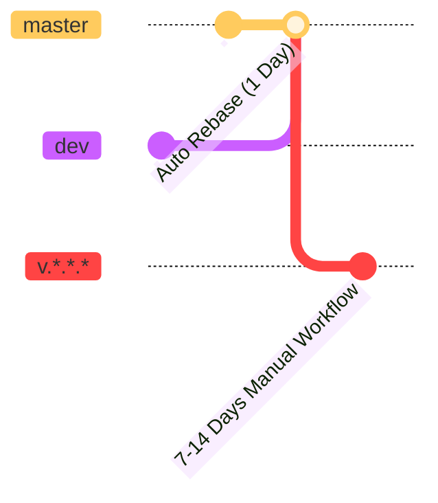

# registry
A Public Registry of Mods/Texturepacks/Profiles that are not avalible on modrinth/curseforge and servers to list from for TeaClient

# Channels

# Contributing

**When submitting a pr please use the dev branch or your pr won't be looked at til it's done.** 

## Adding a server

1. Download our pre-built cli from our github or you can build it from source then run it with `cargo run --release`.

## Building the CLI from source

**Requires ffmpeg for bulding**

1. Download rust
2. Run `cargo build --release`
3. The cli should have been built

## Contributing to CLI

1. Look for [GitHub Issues that you can solve here](https://github.com/TeaClientMC/regisrty).
2. Do your changes, test and submit it as a pr.
3. Wait patiently for a TeaClient Maintainer to repond to your PR this could take up to 7-14 business days. When it the ready to go they will approve it and merge.
4. Wait for your changes to go live in the next version. which is the next version of CLI.

# Credits

- [Lunarclient Server Mapping](https://github.com/LunarClient/ServerMappings) we use this to import every server into TeaClient and this registry.
