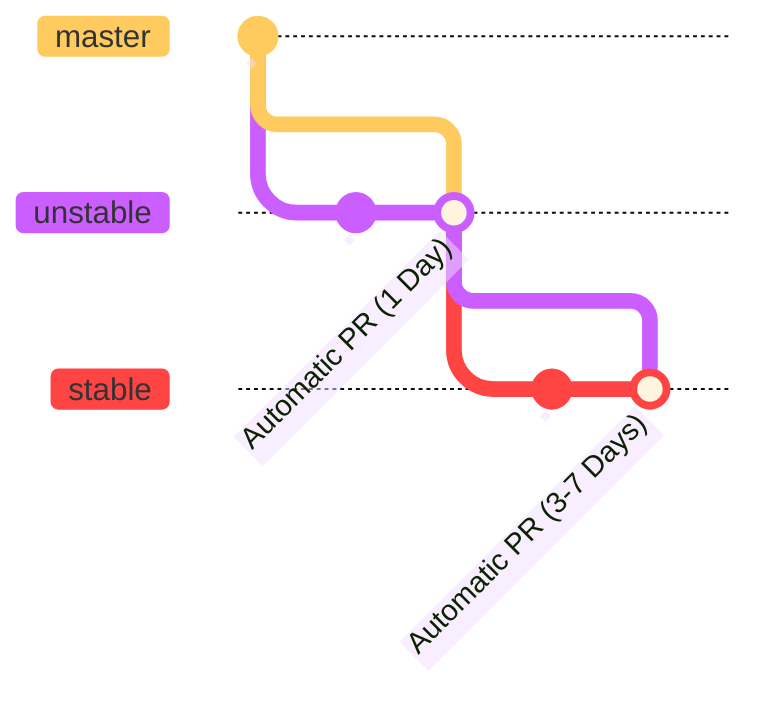

# registry
A Public Registry of Mods/Texture-packs that are missing on CurseForge/Modrinth

# Channels

```mermaid
%%{init: {
    'theme': 'base',
    'themeVariables': {
        'gitInv0': '#ff0000',
        'gitInv1': '#ff0000',
        'git2': '#ff4444',
        'commitLabelFontSize': '15px'
    },
    'gitGraph': {
        'showCommitLabel':true,
        'mainBranchName': 'master',
        'rotateCommitLabel': true
    }
} }%%
gitGraph
    commit id: " "
    branch unstable 
    checkout unstable
    commit id:"   "
    merge master id:"Automatic PR (1 Day)"
    branch stable
    checkout stable
    commit id: "  "
    merge unstable id:"Automatic PR (3-7 Days)"
    checkout master
```
